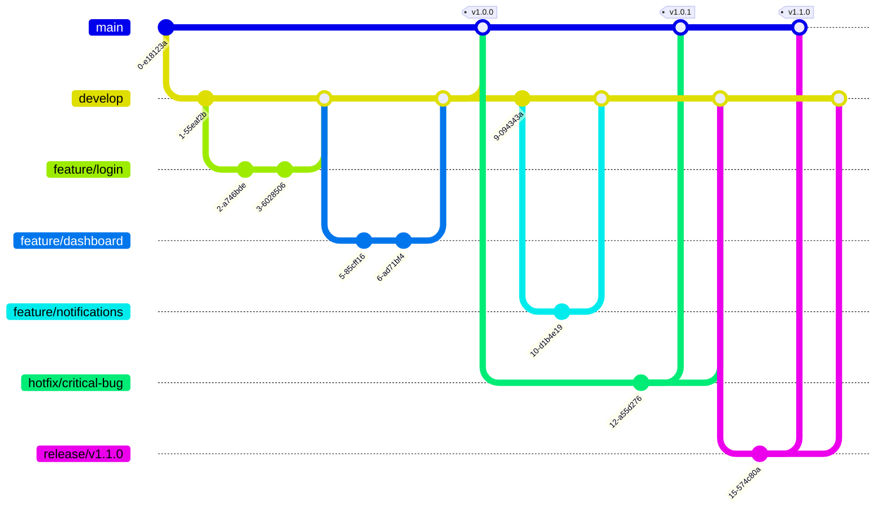

# Vue 3 + TypeScript Project

## Introduction

This template provides a complete setup for Vue 3 to work in Vite with TypeScript. It's designed to help you quickly start a new Vue project with modern technologies and an optimized project structure.

### System Requirements

- Node: >= 18.16.0
- NPM or Yarn

### Core Technology Versions

- Vue: v3.5.13
- Vite: v6.0.5
- TypeScript: ~5.6.2

## Installation and Running the Project

### Installing Dependencies

Use [npm](https://www.npmjs.com/) to install packages.

```bash
# Install dependencies
npm install

# Set up Husky for development environment
npm run prepare
```

### Running the Project in Development Mode

```bash
# Start development server
npm run dev
```

The application will run at the default address: http://localhost:5173

### Building the Project for Production

```bash
# Build for production
npm run build
```

Build results will be saved in the `dist/` directory.

### Running the Project in Production Mode (after building)

```bash
# Preview production build
npm run preview
```

### Checking and Fixing Coding Conventions

```bash
# Check and fix ESLint errors
npm run lint
```

## Technologies Used

### Core

- **Vue 3**: Modern UI library with Composition API, improved TypeScript support, and better performance.
- **Vite**: Fast, efficient build tool designed for modern web development.
- **TypeScript**: Static type support, helping to detect errors early and improve development experience.

### State and Data Management

- **[TanStack Vue Query](https://tanstack.com/query/latest/docs/vue/overview)**: Server-state management library, providing hooks for fetching, caching, and updating data.
- **[Axios](https://axios-http.com/)**: Promise-based HTTP client for making API requests.

### Routing

- **[Vue Router](https://router.vuejs.org/)**: Official router for Vue.js, supporting dynamic routing and nested routes.

### Forms and Validation

- **[VeeValidate](https://vee-validate.logaretm.com/v4/)**: Form validation library for Vue.js.
- **[Yup](https://github.com/jquense/yup)**: Schema validation library, integrates well with VeeValidate.

### Styling

- **[TailwindCSS](https://tailwindcss.com/)**: Utility-first CSS framework, helping to build UI quickly and consistently.
- **[PostCSS](https://postcss.org/)**: Tool for transforming CSS with JavaScript plugins.

### Development Tools

- **[ESLint](https://eslint.org/)**: Linting tool to detect and fix errors in JavaScript/TypeScript code.
- **[Prettier](https://prettier.io/)**: Automatic code formatter, ensuring consistent code style.
- **[Husky](https://typicode.github.io/husky/)**: Git hooks manager, automatically running scripts before commit/push.
- **[Commitlint](https://commitlint.js.org/#/)**: Checks commit messages format according to conventions.

## Project Structure

```
.
├── .husky/                 # Git hooks configuration
├── public/                 # Public static assets
├── src/
│   ├── apis/              # API integration services
│   │   ├── axiosClient.ts # Axios client configuration
│   │   └── endpoints/     # API endpoints by module
│   ├── assets/            # Project assets (images, styles, etc.)
│   ├── components/        # Reusable components
│   │   ├── common/        # Common components (Button, Input, Modal...)
│   │   └── features/      # Feature-specific components
│   ├── layouts/           # Layout components
│   │   ├── MainLayout.vue
│   │   ├── AuthLayout.vue
│   │   └── ...
│   ├── pages/             # Page components
│   │   ├── Home/
│   │   ├── Auth/
│   │   └── ...
│   ├── routers/           # Vue router configuration
│   │   ├── index.ts
│   │   ├── routes.ts
│   │   └── guards.ts
│   ├── types/             # TypeScript type definitions
│   │   ├── api.types.ts
│   │   ├── user.types.ts
│   │   └── ...
│   ├── utils/             # Utility functions
│   │   ├── format.ts
│   │   ├── validation.ts
│   │   └── ...
│   └── App.vue            # Root component
├── .eslintrc.js           # ESLint configuration
├── .prettierrc            # Prettier configuration
├── commitlint.config.js   # Commitlint configuration
├── index.html             # Entry HTML file
├── package.json           # Project dependencies and scripts
├── postcss.config.js      # PostCSS configuration
├── tailwind.config.js     # Tailwind CSS configuration
└── tsconfig.json          # TypeScript configuration
```

## Coding Conventions

### General Principles

- **Clean Code**: Write code that is easy to read, understand, and maintain
- **DRY (Don't Repeat Yourself)**: Avoid code duplication, prefer reusable components and functions
- **Single Responsibility**: Each function, component, or module should have one clear purpose
- **Consistency**: Follow established patterns and conventions throughout the project

### File and Folder Naming

#### Components

- Use **PascalCase** for component files: `UserProfile.vue`, `ProductCard.vue`
- Use **kebab-case** for component folders: `user-profile/`, `product-card/`
- Group related components in feature folders: `components/User/`, `components/Product/`

#### Utilities and Services

- Use **camelCase** for utility files: `formatDate.ts`, `apiClient.ts`
- Use **kebab-case** for folders: `api-endpoints/`, `validation-helpers/`

#### Pages

- Use **PascalCase** for page components: `HomePage.vue`, `UserDashboard.vue`
- Use **kebab-case** for page folders: `home-page/`, `user-dashboard/`

### Vue Component Conventions

#### Component Structure

```vue
<template>
  <!-- Template content -->
</template>

<script setup lang="ts">
// Imports
import { ref, computed } from 'vue'
import type { ComponentProps } from './types'

// Props definition
interface Props {
  title: string
  count?: number
}

const props = withDefaults(defineProps<Props>(), {
  count: 0
})

// Emits definition
interface Emits {
  update: [value: string]
  delete: [id: number]
}

const emit = defineEmits<Emits>()

// Reactive data
const isLoading = ref(false)
const items = ref<string[]>([])

// Computed properties
const totalItems = computed(() => items.value.length)

// Methods
const handleSubmit = () => {
  // Implementation
}

// Lifecycle hooks
onMounted(() => {
  // Implementation
})
</script>

<style scoped>
/* Component styles */
</style>
```

#### Component Naming

- Use **PascalCase** for component names in template
- Use **kebab-case** for component names in template when using custom elements
- Prefix base components with `Base`: `BaseButton`, `BaseInput`
- Prefix layout components with `Layout`: `LayoutHeader`, `LayoutSidebar`

### TypeScript Conventions

#### Type Definitions

```typescript
// Use PascalCase for interfaces and types
interface UserProfile {
  id: number
  name: string
  email: string
  avatar?: string
}

// Use PascalCase for enums
enum UserRole {
  ADMIN = 'admin',
  USER = 'user',
  MODERATOR = 'moderator'
}

// Use camelCase for type aliases
type ApiResponse<T> = {
  data: T
  status: number
  message: string
}
```

#### Function Naming

```typescript
// Use camelCase for functions
const formatCurrency = (amount: number): string => {
  return new Intl.NumberFormat('en-US', {
    style: 'currency',
    currency: 'USD'
  }).format(amount)
}

// Use descriptive names that indicate the action
const fetchUserData = async (userId: number): Promise<User> => {
  // Implementation
}

const validateEmail = (email: string): boolean => {
  // Implementation
}
```

### API and Data Management

#### API Service Structure

```typescript
// src/apis/user.api.ts
import { axiosClient } from './axiosClient'
import type { User, CreateUserRequest } from '@/types/user.types'

export const userApi = {
  // GET requests
  getUsers: () => axiosClient.get<User[]>('/users'),
  getUserById: (id: number) => axiosClient.get<User>(`/users/${id}`),

  // POST requests
  createUser: (data: CreateUserRequest) => axiosClient.post<User>('/users', data),

  // PUT requests
  updateUser: (id: number, data: Partial<User>) => axiosClient.put<User>(`/users/${id}`, data),

  // DELETE requests
  deleteUser: (id: number) => axiosClient.delete(`/users/${id}`)
}
```

#### Query Keys

```typescript
// Use consistent query key structure
export const userKeys = {
  all: ['users'] as const,
  lists: () => [...userKeys.all, 'list'] as const,
  list: (filters: UserFilters) => [...userKeys.lists(), filters] as const,
  details: () => [...userKeys.all, 'detail'] as const,
  detail: (id: number) => [...userKeys.details(), id] as const
}
```

### Styling Conventions

#### Tailwind CSS

- Use utility classes for styling
- Group related classes logically
- Use responsive prefixes consistently
- Prefer Tailwind utilities over custom CSS

```vue
<template>
  <div class="flex items-center justify-between rounded-lg border border-gray-200 bg-white p-4 shadow-sm">
    <h2 class="text-lg font-semibold text-gray-900">User Profile</h2>
    <button
      class="rounded-md bg-blue-600 px-4 py-2 text-sm font-medium text-white hover:bg-blue-700 focus:ring-2 focus:ring-blue-500 focus:outline-none"
    >
      Edit
    </button>
  </div>
</template>
```

#### Custom CSS

- Use `scoped` styles when possible
- Use CSS custom properties for theme values
- Follow BEM methodology for custom CSS classes

```vue
<style scoped>
.user-card {
  @apply rounded-lg bg-white p-4 shadow-sm;
}

.user-card__header {
  @apply mb-4 flex items-center justify-between;
}

.user-card__title {
  @apply text-lg font-semibold text-gray-900;
}

.user-card__content {
  @apply space-y-2;
}
</style>
```

### Error Handling

#### API Error Handling

```typescript
// Use consistent error handling patterns
const handleApiError = (error: unknown) => {
  if (axios.isAxiosError(error)) {
    const message = error.response?.data?.message || 'An error occurred'
    // Handle specific error cases
    switch (error.response?.status) {
      case 401:
        // Handle unauthorized
        break
      case 404:
        // Handle not found
        break
      default:
      // Handle other errors
    }
  }
}
```

#### Component Error Boundaries

```vue
<script setup lang="ts">
import { onErrorCaptured } from 'vue'

onErrorCaptured((error, instance, info) => {
  // Log error and handle gracefully
  console.error('Component error:', error)
  return false // Prevent error from propagating
})
</script>
```

### Performance Best Practices

#### Component Optimization

```vue
<script setup lang="ts">
import { defineAsyncComponent } from 'vue'

// Lazy load components
const HeavyComponent = defineAsyncComponent(() => import('./HeavyComponent.vue'))

// Use v-memo for expensive computations
const expensiveValue = computed(() => {
  // Expensive computation
})
</script>

<template>
  <div v-memo="[expensiveValue]">
    <!-- Content that depends on expensiveValue -->
  </div>
</template>
```

#### List Rendering

```vue
<template>
  <!-- Always use key with v-for -->
  <div v-for="item in items" :key="item.id" class="item">
    {{ item.name }}
  </div>

  <!-- Use v-show for frequently toggled elements -->
  <div v-show="isVisible" class="tooltip">Tooltip content</div>
</template>
```

### Testing Conventions

#### Component Testing

```typescript
// Use descriptive test names
describe('UserProfile', () => {
  it('should display user information correctly', () => {
    // Test implementation
  })

  it('should emit update event when form is submitted', () => {
    // Test implementation
  })

  it('should handle loading state properly', () => {
    // Test implementation
  })
})
```

### Documentation

#### Code Comments

- Comment complex business logic
- Document non-obvious code decisions
- Use JSDoc for function documentation
- Avoid commenting obvious code

```typescript
/**
 * Formats a date string to a human-readable format
 * @param dateString - ISO date string
 * @param locale - Locale for formatting (default: 'en-US')
 * @returns Formatted date string
 */
const formatDate = (dateString: string, locale = 'en-US'): string => {
  return new Intl.DateTimeFormat(locale, {
    year: 'numeric',
    month: 'long',
    day: 'numeric'
  }).format(new Date(dateString))
}
```

#### README Documentation

- Keep documentation up to date
- Include setup instructions
- Document API changes
- Provide usage examples

### Git Workflow

#### Branch Naming

- Feature branches: `feature/user-authentication`
- Bug fixes: `fix/login-validation`
- Hotfixes: `hotfix/critical-security-issue`
- Releases: `release/v1.2.0`

#### Commit Messages

- Follow conventional commits format
- Use present tense
- Be descriptive but concise
- Reference issues when applicable

## 📜 Scripts

The project includes several npm scripts to help with development:

```bash
# Install dependencies
npm install

# Run development server
npm run dev

# Build for production
npm run build

# Preview production build
npm run preview

# Lint and fix code
npm run lint

# Prepare Husky hooks
npm run prepare
```

## 🔧 Git Hooks

The project uses Husky to manage Git hooks:

- `pre-commit`: Check linting and formatting before commit
- `commit-msg`: Check commit message format
- `pre-push`: Run checks before pushing code

## 📝 Commit Rules

This project follows [Conventional Commits](https://www.conventionalcommits.org/) specification. Each commit message must be structured as follows:

```
<type>(<scope>): <description>

[optional body]
[optional footer(s)]
```

Examples:

```
feat(auth): implement login functionality
fix(router): resolve navigation guard issue
chore(deps): update dependencies to latest version
docs(readme): update installation guide
```

### Commit Types

- `feat`: A new feature
- `fix`: A bug fix
- `build`: Changes that affect the build system or external dependencies
- `ci`: Changes to CI configuration files and scripts
- `docs`: Documentation only changes
- `perf`: A code change that improves performance
- `refactor`: A code change that neither fixes a bug nor adds a feature
- `style`: Changes that do not affect the meaning of the code
- `test`: Adding missing tests or correcting existing tests
- `chore`: Other changes that don't modify src or test files

### Rules

- Type and scope should be lowercase
- Scope is optional and must be in parentheses
- Description must start with lowercase letter
- Description should be in imperative mood: "change" not "changed" or "changes"
- Description should not end with a period
- Total length of description cannot exceed 100 characters
- A blank line is required between title and body
- Breaking changes must be indicated by "!" before the ":"

## Contribution Guidelines

1. Fork the project
2. Create a feature branch (`git checkout -b feature/amazing-feature`)
3. Commit your changes (`git commit -m 'feat: add some amazing feature'`)
4. Push to the branch (`git push origin feature/amazing-feature`)
5. Create a Pull Request

## License

This project is distributed under the MIT License. See the `LICENSE` file for more details.

## Contact

If you have any questions or suggestions, please create an issue in the repository or contact the project maintainer.

## Git Flow

This project follows a simplified Git flow workflow to maintain code quality and streamline the development process.



### Branches

- **main**: Production code. Only merged from release branches or hotfixes.
- **develop**: Integration branch where features are combined and tested.
- **feature/\***: Individual feature branches created from develop.
- **hotfix/\***: Emergency fixes for production issues, branched from main.
- **release/\***: Preparation for a new production release, branched from develop.

### Workflow

1. **Feature Development**

   - Create a feature branch from develop: `git checkout -b feature/new-feature develop`
   - Develop the feature with regular commits
   - When complete, create a PR to merge back into develop

2. **Release Preparation**

   - Create a release branch when develop is ready for release: `git checkout -b release/v1.0.0 develop`
   - Make only bug fixes and documentation updates in this branch
   - When ready, merge to both main and develop:
     ```
     git checkout main
     git merge --no-ff release/v1.0.0
     git tag -a v1.0.0
     git checkout develop
     git merge --no-ff release/v1.0.0
     ```

3. **Hotfixes**
   - For critical production bugs, create a hotfix branch from main: `git checkout -b hotfix/critical-bug main`
   - Fix the issue
   - Merge back to both main and develop:
     ```
     git checkout main
     git merge --no-ff hotfix/critical-bug
     git tag -a v1.0.1
     git checkout develop
     git merge --no-ff hotfix/critical-bug
     ```

This workflow helps maintain a clean repository history and provides a structured approach to development, testing, and releases.
